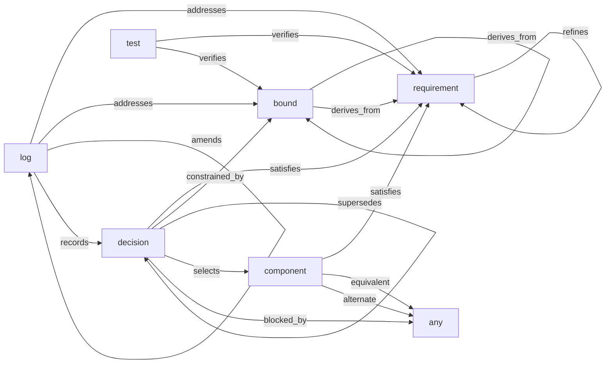

# Links and traceability

## Declaring links

Links are fields whose values are item IDs. Which link names are legal on a type,
and what they may point at, is declared in `refdes.yaml`:

```yaml
types:
  decision:
    links:
      satisfies:      [requirement]
      constrained_by: [bound]
      supersedes:     [decision]
```

In an item:

```yaml
satisfies:      [REQ-PWR-002, REQ-PWR-003]
constrained_by: [BND-THM-001]
```

The [standard library](standard-library.md) already declares this vocabulary for
the six standard types, so most projects never write a `types:...links:` block at
all — this is what to reach for on a custom type, or one the standard doesn't
cover.

Pointing at a nonexistent item, or at an item of a type the schema disallows, is a
build error.

## Back-links are computed

Each link type declares its inverse:

```yaml
link_types:
  verifies:  { inverse: verified_by,  label: "Verifies" }
  satisfies: { inverse: satisfied_by, label: "Satisfies" }
```

Declare the edge from **either** end and the other direction appears automatically.
A test saying `verifies: [REQ-PWR-002]` gives the requirement
`verified_by: [TST-PWR-002]` without the requirement mentioning it.

Declare it from whichever end is natural — a test knows what it covers; a decision
knows what it satisfies. Declaring both ends is allowed but redundant.

## Starter link types

The table below is the detail, sequenced view: one row at a time, source type
first. For the all-at-once view — what can point at what, and with which
word — here is the same vocabulary as a graph, generated straight from the
resolved schema with `refdes schema --graph` rather than hand-drawn, so it
can't quietly go stale the way a hand-maintained diagram (or table) does the
first time a preset or project overlay changes a verb:



Regenerate this against whatever project you actually care about (its own
overlay and presets included) with `refdes schema --graph`, piped to a file
or straight into anything that renders Mermaid.

| Link | Inverse | Typical use |
|---|---|---|
| `refines` | `refined_by` | a requirement narrowing another requirement, or a bound narrowing another bound |
| `derives_from` | `derived_by` | a bound derived from a requirement or another bound |
| `satisfies` | `satisfied_by` | decision or component → requirement |
| `constrained_by` | `constrains` | decision → bound |
| `verifies` | `verified_by` | test → requirement or bound |
| `selects` | `selected_by` | decision → component |
| `addresses` | `addressed_by` | log entry → requirement or bound |
| `amends` | `amended_by` | log entry → earlier log entry |
| `records` | `recorded_by` | log entry → decision |
| `supersedes` | `superseded_by` | decision → older decision |
| `blocked_by` | `blocks` | decision → anything holding it up — see [below](#blocked-by-and-the-cascade-report) |
| `equivalent` | `equivalent` (self-inverse) | component → drop-in second source — see [below](#part-equivalence-equivalent-and-alternate) |
| `alternate` | `alternate` (self-inverse) | component → functionally close, check before substituting — see [below](#part-equivalence-equivalent-and-alternate) |

Add your own by declaring them in `link_types` and listing them under a type's
`links:`.

## Part equivalence: `equivalent` and `alternate`

**This isn't a parts database.** A manufacturer's own equivalence data —
"these two op-amps are pin-compatible per the datasheet" — belongs in
whatever system of record already holds part numbers and AVL lists, not
here. What belongs in refdes is narrower: *this project's author has
decided* two components are interchangeable for *this design*. That's a
reviewable claim, not a fact about silicon — it can be wrong, and it can go
stale when a requirement changes.

Two verbs, both `component` → `component`, because they mean different things:

```yaml
- id: CMP-014
  equivalent: [CMP-019]      # drop-in, no review needed
- id: CMP-021
  alternate: [CMP-014]       # functionally close -- check before substituting
  rationale: Higher ESR at the output cap; verify ripple before swapping.
```

**`equivalent`** — a drop-in second source. The claim ("these are
interchangeable") is complete on its own, so `rationale` is optional.

**`alternate`** — functionally close but not a drop-in. `rationale` is
**required** (`required_when: {links: alternate}`) because the entire
content of the claim is *which way* it isn't quite a drop-in — recording
"there's something you should know" with no statement of what is worse than
not recording the relationship at all.

Both are declared on `component` only. A part known only through a
citation's nested `part_number` (see [parts](parts.md)) has no item to link
from — promoting it to a real `component` is what makes an equivalence claim
possible, and is itself a reason to give it an item.

Both are restricted to `component` targets, and that restriction is
checked — `equivalent: [REQ-PWR-001]` on a component is a build error.

> **Only from `hardware@4` onward.** v1 to v3 wrote both target lists as
> `[]`, which the loader reads as *unrestricted* (the same way
> `decision.blocked_by: []` deliberately is), so on those versions the same
> line builds clean. A project pinned below v4 keeps that behaviour, since a
> pinned version never changes under you; `refdes standard upgrade --to 4`
> is what opts into the check, and it will refuse and roll back if an
> existing link doesn't satisfy it — telling you which one.

### Equivalence is symmetric — the self-inverse link

Every other link in this vocabulary is directional: satisfying isn't the
same claim as being satisfied, so each gets its own inverse name. Equivalence
has no natural passive form — if CMP-014 is `equivalent` to CMP-019, CMP-019
is, identically, `equivalent` to CMP-014, not "equivalented by" it.
`equivalent`/`alternate` declare themselves as their own inverse
(`{ inverse: equivalent, ... }`), which the loader already handles with no
special-casing.

Because of this, an item page merges its own declarations with the computed
backlink into one list before rendering, rather than showing the identical
fact twice under "Outgoing" and "Incoming." A component declaring
`equivalent: [CMP-019]`, and CMP-019 separately declaring `equivalent:
[CMP-014]` back, is harmless — the merge de-duplicates to one visible entry
either way, so there's nothing to validate and nothing worth warning about.

## `blocked_by:` and the cascade report

A decision on hold pending an unresolved question routinely has other
decisions depending on its outcome. `blocked_by:` records that dependency,
targeting any item type with no restriction:

```yaml
- id: DEC-IO-005
  blocked_by: [DEC-IO-001]
```

**The declared edge is direct** — an item names only its immediate
blocker(s) — **but the report resolves transitively**, because naming the
root cause, not the nearest link in the chain, is the whole value. `DEC-IO-016`
declaring `blocked_by: [DEC-IO-003]`, itself `blocked_by: [DEC-IO-001]`,
reads as blocked on `DEC-IO-001`, with the full path shown, not collapsed:

```
DEC-IO-016 <- DEC-IO-003 <- DEC-IO-001 (on_hold, root)
```

"Root" is structural — the walk follows `blocked_by` edges until it reaches
an item declaring none of its own — not status-based. Whether the root, or
any link along the path, has since become settled is a separate question:
see the stale check below.

**No status restriction on the target**, deliberately: `blocked_by:` may
point at an item of any type in any status, since the edge records a real
dependency regardless of the blocker's current state. Validating that a
target is "currently unsettled" was considered and rejected — status is
mutable, so that check would have to re-run forever just to keep agreeing
with itself.

**A cycle is a hard build error**, never silent truncation, reported at the
file:line of the edge that actually closes the loop:

```
ERROR items/main-io/decisions.md:12 [DEC-IO-003] — blocked_by cycle:
  DEC-IO-003 -> DEC-IO-001 -> DEC-IO-003
```

**The stale-blocker check.** The moment an edge stops being live — its
target reaches a settled status (per the type's `satisfying_statuses:` or
`verifying_statuses:`, see [coverage](coverage.md)) while the blocked item
still declares it — is worth a nudge:

```
INFO items/main-io/decisions.md:80 [DEC-IO-005] — blocked_by DEC-IO-001, which
  is now 'accepted' — is it still blocked? Remove the edge if resolved, or say
  in 'rationale' why it still applies.
```

`info`: default-hidden (a project mid-resolution trips this repeatedly as
blockers clear one at a time, which is normal, not a defect), shown with
`-v`/`--verbose`, and always shown in `refdes audit` regardless.

**Three existing surfaces, no new command.** `refdes audit` gets a "Blocked
chains:" section, one line per resolved chain, flagging staleness inline. The
blocked item's own page gets a small panel showing its chain to root.
`coverage.html` is where the headline sentence — "these requirements are
unsettled *because of* this one open question" — actually lands; see
[coverage](coverage.md#when-the-claimer-is-blocked).

## Cross-references in prose

Two forms, both producing hover previews:

```markdown
The thermal budget in BND-THM-001 drives this.          <- bare, autolinked
See [[REQ-PWR-002|the input voltage range]] for detail.  <- explicit, custom text
```

**Bare IDs autolink** when they resolve to a real item. A token that merely looks
like an ID — `MIL-STD-810`, `DO-254`, `LTC3388-1` — is left as plain text unless
you happen to have an item with that exact ID. Wrap anything in backticks to
suppress linking entirely.

**Explicit `[[...]]` references are validated.** An unresolved one is a warning and
renders in red, so use this form when a broken reference should be noticed.

A `[[fig:some-id]]` reference — the same `[[...]]` envelope, a `fig:` prefix —
resolves to a numbered figure instead of an item. See [width and
captions](markdown.md#width-and-captions).

## Hover previews

Every reference shows a preview card on hover: type badge, ID, title, selected
fields, and the target's **current check state** — so you can see that a bound
is being violated without leaving the page you are reading.

Which fields appear is set per type:

```yaml
types:
  bound:
    preview: [status, limit, rationale]
```

Previews are generated at build time and inlined into the page. There are no
network calls. Without JavaScript they degrade to ordinary working links. They are
keyboard-accessible (focus to show, Escape to dismiss) and tap-to-open on touch
devices.

## Traceability on an item page

Each item page lists **Outgoing** links (what it declares) and **Incoming** links
(what points at it), grouped by relationship. Combined with
[coverage](coverage.md), this is the traceability story: from a requirement you can
reach the log entries that worked on it, the decision that satisfies it, and the
test that verifies it.
